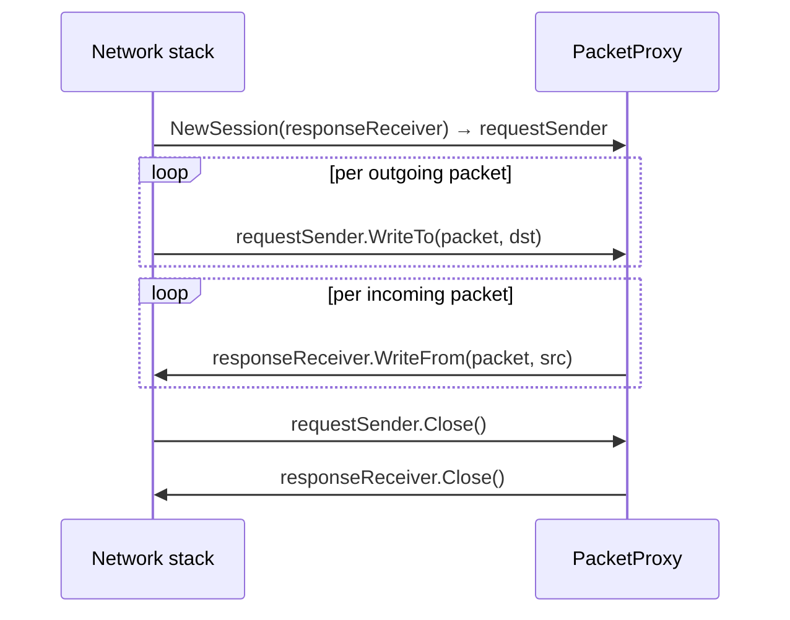
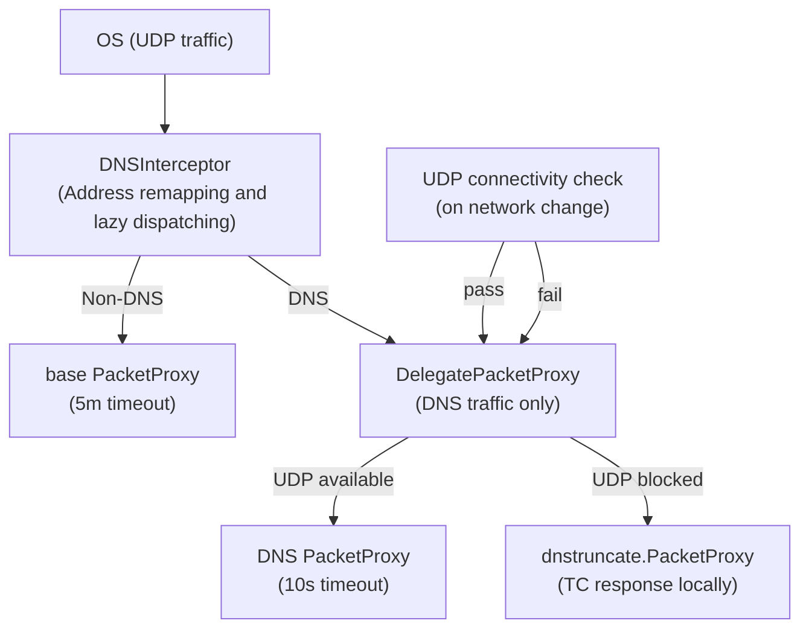
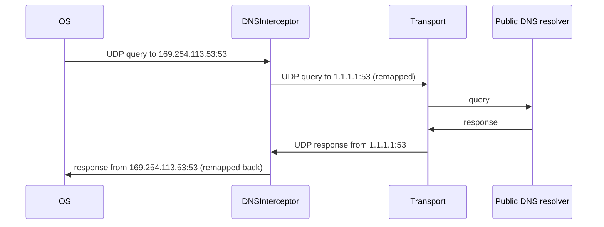
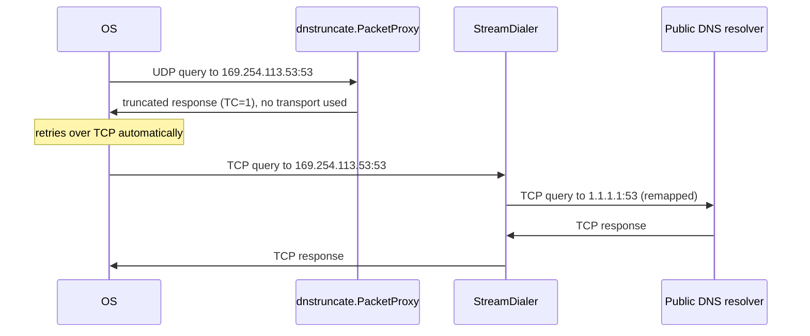

# dnsintercept

This package intercepts DNS traffic inside the VPN tunnel and routes it reliably through the proxy, even when UDP is blocked by the network.

## Key abstractions

This package works in terms of three interfaces from the `golang.getoutline.org/sdk/network` package that model UDP packet flow through the proxy.

**`PacketProxy`** represents anything that can handle UDP sessions.  It has a single method:

```go
NewSession(resp PacketResponseReceiver) (PacketRequestSender, error)
```

Calling `NewSession` tells the proxy that a new UDP flow has started.  The caller supplies a `PacketResponseReceiver` (where incoming packets will be delivered) and gets back a `PacketRequestSender` (where it will send outgoing packets).

**`PacketRequestSender`** is the outbound half of a session — the handle the network stack uses to send packets *into* the proxy:

```go
WriteTo(p []byte, destination netip.AddrPort) (int, error)
Close() error
```

**`PacketResponseReceiver`** is the inbound half — a callback the proxy calls to deliver packets *back* to the network stack:

```go
WriteFrom(p []byte, source net.Addr) (int, error)
Close() error
```

Put together, a session looks like this:



The two halves are independent: outgoing packets flow through `WriteTo`, incoming packets are pushed back via `WriteFrom`.  Either side can close independently.

The wrappers in this package implement `PacketProxy` and intercept `WriteTo` / `WriteFrom` calls to rewrite addresses or generate synthetic responses, then delegate to an inner proxy for everything else.

## Background

When the Outline VPN is active, the OS is configured to send all DNS queries to a fake link-local address (`169.254.113.53:53`).  This address is served by the VPN tunnel itself — no real server listens there.  The `dnsintercept` package sits at the boundary between the OS and the proxy transport, intercepting those queries and handling them appropriately.

DNS can travel over both TCP and UDP:

- **TCP** is simple: queries always get through via the proxy's stream dialer.
- **UDP** is conditional: queries can be forwarded via UDP only if the proxy supports it.  On some networks, UDP is blocked entirely.

## How UDP DNS is handled

UDP connectivity is not guaranteed, so the package uses two strategies and switches between them dynamically.

### Dynamic switching

The two modes are wired together by the caller (`configregistry.wrapTransportPairWithOutlineDNS`) using a `DelegatePacketProxy` and a `DNSInterceptor`.



The `DNSInterceptor` acts as the primary dispatcher. It routes non-DNS traffic directly to the transport and DNS traffic to a dedicated delegate proxy. This delegate proxy switches between forwarding and truncation based on the result of a periodic UDP connectivity check. Transport sessions are opened lazily upon receiving the first packet, ensuring resources are only used when needed.


### Forward mode (UDP available)

DNS queries are forwarded over UDP to a public resolver (Cloudflare, Quad9, or OpenDNS, chosen randomly per session) through the proxy transport.  Addresses are rewritten between the fake link-local address and the real resolver address.



Each DNS session uses a standard transport session. The transport handles the lifecycle, usually timing out after standard UDP idle timeouts.

### Truncate mode (UDP unavailable)

If UDP is blocked, forwarding silently fails and DNS stops working.  To handle this, the package falls back to *truncate mode*: it responds immediately to every UDP DNS query with a [truncated DNS response](https://www.rfc-editor.org/rfc/rfc1035#section-4.1.1) (the TC bit set).  This is a standard DNS signal telling the OS to retry the same query over TCP, which goes through the stream dialer and always works.



In truncate mode, no transport session is opened for DNS at all — the truncated response is generated locally.


## Package contents

| File | Description |
|------|-------------|
| `interceptor.go` | Contains `NewDNSInterceptor` for dispatching/remapping DNS packets, and `NewDNSRedirectStreamDialer` for TCP DNS. |
| `lazy_packet_proxy.go` | Implements `lazyPacketProxy` to defer session creation until the first write. |
